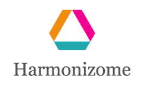

Harmonizome 3.0
=================================================



## Motivation
Harmonizome was last updated from 2014-2016, however there are many users accessing Harmonizome daily. The UI/UX of Harmonizome is good, but the content and resources need to be updated. Previous attempts have been made to update Harmonizome, but due to time constraints it was dropped. During previous attempts, there was an initial attempt to determine which resources were updated and which were not. 


Table of Contents 
-----------------
* [Usage](#usage)
* [About-Harmonizome](#About-Harmonizome)
* [Authors and history](#authors-and-history)
* [Acknowledgments](#acknowledgments)
* [References](#references)

## Usage
- Clone the repository
```bash
git clone 'https://github.com/beagan-svg/ETL-Repository'
```
- Run Jupyter Notebook ETL
- Inputs: Appyter ETL Process Files, harmonizome.sql, schema.txt (Located in Input Directory)
------------------------------------------------------------------


## About-Harmonizome
There is a ton of omics related data that is constantly being generated everyday. And this is good because the more data that we have, the more effective our analysis will be. As a result, there is a plethora of web platforms for biomedical research that contains well curated information about genes, proteins, pathways, and tissue expression. This enables researchers in the field to gain many new insights of how drugs can induce changes in gene and protein expression in mammalian cells on a global scale. This also helps explain how they work from a system-level perspective. 

However, the challenge is that many developing online databases that attempts to connect information from different resources, lack the essential knowledge for discoveries in personalized medicine. This includes finding novel relationships between genes and phenotypes, measuring expression after drug treatment, and many more. There are a few online databases that do provide this information, but are commercial products and as a result lack an open and free API.  

Thus, this led to development of Harmonizome developed by the Ma’ayan Lab. Harmonizome is a comprehensive collection of extracted and organized data of about 72 millions functional associations between genes/proteins, and their attributes from 112 datasets generated by processing 65 resources. The attributes could be relationships with other biomolecules, expression in cell lines and tissues, or changes in gene expression. Here researchers could type in the gene, geneset, or dataset they are interested in and will be displayed a result page to get more details about their term of interest. The display page also includes a list of different formats of the processed dataset such as data matrices, gene set libraries, and edge lists. Users also have access to the python scripts of the dataset associated as well as the API. With these dataset formats this enables researchers to predict knowledge about genes that are not yet studied and find novel relationships to for example genes and phenotypes. As they say, a picture is worth a thousand words, so harmonizome also includes visualization features such as interactive heat maps of hierarchical clustered datasets. This enables researchers to explore for example clusters of genes associated with a phenotype or biological system, view genes or cells that are similar to each other, and view expression patterns across cell lines.  

There are many ways to utilize Harmonizome for biomedical research and there have been thousands of users that visit the site since it was developed in 2015. However, Harmonizome needs to be updated to keep up with growing demand for knowledge from users and integrate updated datasets from its resources. 

------------------------------------------------------------------

## Authors and History

* Beagan Nguy - Algorithm Design

## Acknowledgments

Ma'ayan Laboratory
 
## References


